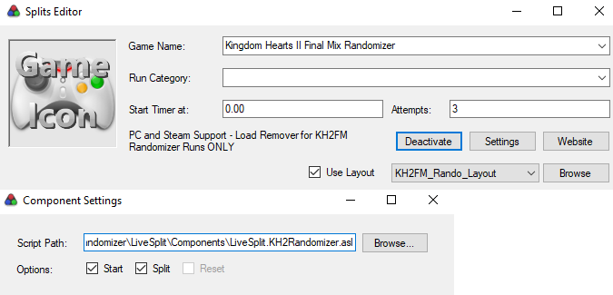

# KH2FM Randomizer Load Remover for PCSX2 v1.6, PCSX2-EX, and PC

**(Updated for Steam Release)** *Created by: AliosGaming and ZakTheRobot* 

**v2.4 update provided by Equations and Geek. Huge thanks to both of them.**

***DISCLAIMER: This Load Remover is only intended for use during KH2FM Randomizer Races and Practice***

This guide assumes you have already installed [Livesplit](https://livesplit.org/) on your PC
## (Automated-ish) How to install the load remover and basic layout to Livesplit:

> [!NOTE]
> *If you previously had the Load Remover installed in your Livesplit layout you should remove the `Scriptable Auto Splitter` from your layout settings and then skip to step 3.*

1. Download this basic layout file for Livesplit [HERE](https://raw.githubusercontent.com/aliosgaming/KH2FM_Load_Remover-FOR-RANDOMIZER/main/KH2FM_Rando_Layout.lsl) (Right click + `Save Link as...`). It adds two timers to the Livesplit layout. One for Real time and another for Game time (which pauses on loads).

2. Right click Livesplit and go to `Open Layout` then click `From File...` and navigate to the layout file you downloaded. It should load in the two timers (top is Real time and bottom is Game time)

3. Now, right click your Livesplit window and select `Edit Splits`.

4. In the `Game Name` text box manually type in `Kingdom Hearts II Final Mix Randomizer`. (The randomizer is not currently in the drop down list so you must type out the whole name manually)

5. You should see a message about the load remover pop up below the `Start Timer at:` text. (You can reference the image below) Next to that message click the `Activate` button.

6. Now, click on the `Settings` button and in the new window enable the `Start` and `Split` boxes. These will enable Livesplit to automatically start and stop the timer for you. You can close the `Settings` window now.

7. Finally, back on the `Edit Splits` window, enable the `Use Layout` box and use the drop down menu to select your `KH2FM_Rando_Layout` file. You have now completed the setup. 

 
## (Manual) How to install the load remover to Livesplit:

What you need:
 - [Livesplit](https://livesplit.org/) <- Your timer
 - [Livesplit.KH2Randomizer.asl](https://github.com/aliosgaming/KH2FM_Load_Remover-FOR-RANDOMIZER/releases/tag/v2.3) <- The script you downloaded from this github
 
1. Right click your Livesplit window and select `Edit Layout`.

2. In the layout editor window press the big `+` button in the top left corner, then hover over `Control` and then click on `Scriptable Auto Splitter` option.

3. `Scriptable Auto Splitter` should now be added to your list in the layout editor. Double click the new `Scriptable Auto Splitter` line to open up its layout settings.
	
4. Click `Browse` on the right side of the new window and navigate to your `Livesplit.KH2Randomizer.asl` file and select it.
> [!TIP]
> :ballot_box_with_check: Check the `Start` box to have the timer auto-start when you begin a seed
>
> :ballot_box_with_check: Check the `Split` box to have the timer auto-stop when you defeat Final Xemnas

## (Manual) How to add timers to Livesplit Layout:

5. You will want two timers in your Livesplit layout in order for the script to work. You can add more timers to your layout by clicking the big `+` button again in the Layout Editor screen and selecting `Timer`.
   * Create one timer and set it's `Timing Method` to `Real Time`
   * Create another timer and set it's `Timing Method` to `Game Time`
   * `Real Time` will run like normal and will never pause, while `Game Time` will pause during loads and room transitions.

> [!NOTE]
> **SAVE YOUR LAYOUT** after setting everything up. If you dont then you will have to go through the process all over again every time you close and re-open livesplit

6. That is it! Once LiveSplit and your game are both open the script will auto attach to your game. The script will work for Emulator or PC automatically and you don't need to change anything if you swap between the two. If you would like to verify that the script has attached to your game then you can check by opening up the `Scriptable Auto Splitter` settings again and looking to the right of the `Options:` section. You should see a message saying `Game Version:` followed by either `EMULATOR`, `EMULATOR-EX`, `GLOBAL-STEAM`, or `GLOBAL-EPIC` depending on if you are using PCSX2, PCSX2-EX, or PC from Epic or Steam respectively.  

**TLDR:**
- Add `Scriptable Auto Splitter` to Livesplit
- Choose Script
- Add Timers for `Game Time` and `Real Time` to Livesplit
- Play KH2

